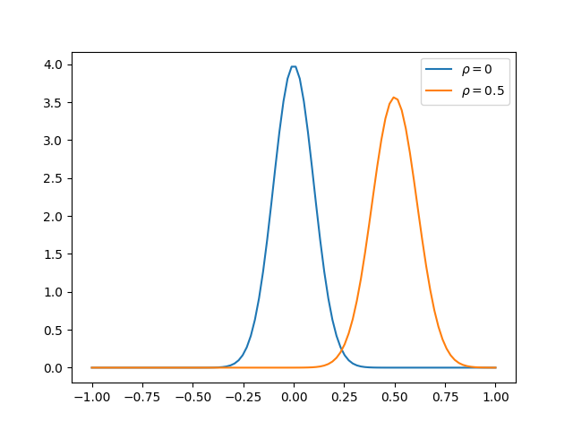
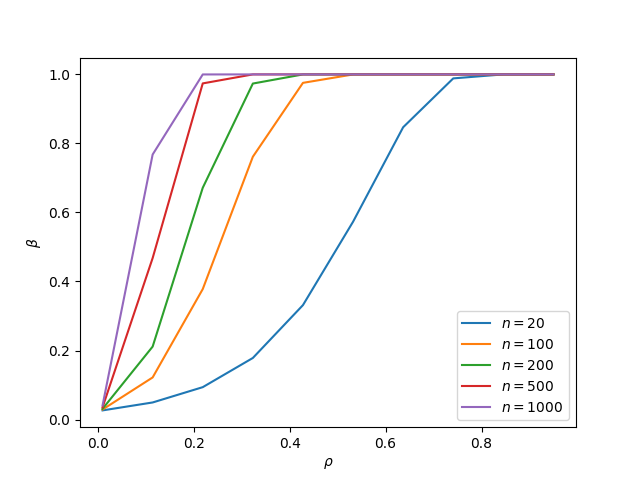

# Task 1

### Part A
Suppose $\theta \ in [0,1]$ is flag of oracle and $x_i \in [0,1]$ is outcome of $i$ trial. Hence probability of task statement for ordinary person can be rewritten as:
$$
    P(x_1=1,\dots,x_10=1 | \theta =0 ) = P(x_1 =1 | \theta=0) \dots  P(x_10 =1 | \theta=0) P(\theta =0) = 10^{-3} 0.9^(10) 
$$
Factorization comes from fact that trials are independent. Likewise, for oracle:
$$
    P(x_1=1,\dots,x_10=1 | \theta =1 ) =  (1 - 10^{-3}) 0.5^(10)
$$
Using bayesian formula, we will achieve:
$$
    P(\theta=1| x_1=1,\dots,x_10=1) = \frac{P(x_1=1,\dots,x_10=1 | \theta =1 )}{P(x_1=1,\dots,x_10=1 | \theta =1 ) + P(x_1=1,\dots,x_10=1 | \theta =0 )}
$$
### Part B

Assume that oracle persist in competition and k is sufficient enough, than 
dramatic difference of successful guess in trials. Hence, probability of finding oracle in
competition simplifies to probability of entrance of at least one oracle. Which is evidently equals
to 100/1000=0.1 Therefore, prior existence of oracle in setting of part A alters to 0.1. This substantially
changes probability of finding oracle.

Graph for $k\in[0,1000]$ is provided in [Notebook](./task1.ipynb)

Fun fact
[Fisher–Tippett–Gnedenko theorem](https://en.wikipedia.org/wiki/Fisher%E2%80%93Tippett%E2%80%93Gnedenko_theorem)
states that maximum of iid normal variables $N(\mu,\sigma^2)$ converges to Gumbel distribution. 

# Task 2

Quantile estimation of large population (k >>1) can be asymptotically estimated with normal distribution with known distribution  [Wiki](https://en.wikipedia.org/wiki/Order_statistic#Large%20sample%20sizes):
$$
    Q \sim \mathcal{N}(F^{-1}(p), \frac{p(1-p)}{n[f(F^{-1}(p))]^2})
$$

Obviating of direct estimation of density function can be achieved through bootstrap techniques.
That is, we'll build quantile estimation as mean of estimators on samples from original population.
Based on [lecture materials](https://people.cs.umass.edu/~phaas/CS590M/slides/slecture09h.pdf):
$$
    \hat{Q} = \sqrt{\frac{\nu}{m}} \xi, \xi \sim  T_{m-1} 
$$,
where $m$ - number of bootstrap samples, $T$ is student distribution and $\nu_n = \frac{1}{m-1} \sum_{i=1}^n (Q_i - \hat{Q})^2$  

Required hypothesis can be achieved through comparing estimator
with $\alpha/2$ and $1-\alpha/2$ quantiles.

Proof on concept is provided in corresponding [notebook](tasks/task2.ipynb)

# Task 3

Without reasonable approximation statistic:

$$
    T(\mathbf{Z}) = \frac{1}{n} \sum_{i=1}^n x_i y_i
$$

is seamed hard to approximate (look for SOTA method [here](https://www1.up.poznan.pl/cb48/prezentacje/Oliveira.pdf)). Therefore, use large scale approximation.

First, we will start with transform to indepent variables using cholesky decomposition (look [through](https://www2.stat.duke.edu/courses/Spring12/sta104.1/Lectures/Lec22.pdf)):
$$
    X= Z_1 \\
    Y = \rho Z_1 + \sqrt{1-\rho^2} Z_2
$$,
with $Z_1, Z_2 \sim \mathcal{N}(0,1)$ 
Therefore expected value is 
$$
    E(XY) = \rho E(Z_1^2) + \sqrt{1-\rho^2} E(Z_1) E(Z_2) = \rho
$$
Yield second order using second order moment:
$$
    E((XY)^2) = E((\rho Z_1^2 + \sqrt{1-\rho^2} Z_1 Z_2)^2) = 
    E(\rho^2 Z_1^4 + 2 \rho \sqrt{1-\rho^2} Z_1^3 Z_2 + (1-\rho^2) Z_1^2 Z_2^2) = \\ 3 \rho^2 + 1-\rho^2  = 1 + 2 \rho^2
$$

Therefore, dispersion:
$$
    D(XY) = 1 + \rho^2
$$

Using central limit theorem:
$$
    \sqrt{N} (T(Z) - \rho) = N(0,1 + \rho^2)
$$

Code can be visited here [graph](tasks/task3.ipynb) 

Therefore appropriate criterion can be sourced from quantile of aforemention normal distribution approximation:
$$
    |T(x)| < z_{1-\tfrac{\alpha}{2}} 
$$

Power of criterion abides following distribution:

For $n \in  [20,100,200,500,1000]$

Analytical inference for $n \gg 1$ is derived as survival function of $\mathcal{N}(\rho,\frac{1 + \rho^2}{n})$ from $z_{1-\tfrac{\alpha}{2}}$. 

Recall, distribution of statistics $T(\mathbf{Z})= \frac{1}{2n}\sum_{i=1}^n (x_i -y_i)^2$ is $\frac{1-\rho}{n} \xi$, $\xi \sim \chi^2(n)$. Therefore, criterion is 
$$
    \frac{1-\rho}{n} \Phi_{\alpha/2} < T(\mathbf{Z}) < \frac{1-\rho}{n} \Phi_{1-\alpha/2}
$$,
where $\Phi_\beta$ denotes $\beta$ quantile of $\chi^2(n)$ distribution.

So power of criterion can be estimated of cumulative density function of $\xi^2(n)$ distribution from $\frac{1}{1-\rho} \Phi_{1-\tfrac{\alpha}{2}}$

Second statistic is better for $n<20$ due to easy of rigorous inference, yet first statistics has more rapid increase in power with $n >>1$.

# Task 4

If x,y are independent distribution of 
pearson coefficient is given via [cdf](https://docs.scipy.org/doc/scipy/reference/generated/scipy.stats.pearsonr.html):
$$
    \frac{(1-r^2)^{n/2}}{\mathbb{B}(\frac{1}{2},\frac{n}{2}-1)}
$$  

Using scipy we can compute that probability of finding $\rho > 0.97$ is approximately $10^{-7}$, which is intractable for modeling.

# Task 5

Naive bayes approach can be spoiled via abuse of it's single factor approach. This is it,
suppose classification is designated to dataset (X,Y), where X is collection of tuple (x_1,x_2), with $x_i \sim Bern(0.5)$ and $Y = x_1 * x_2$. Therefore, naive bayes learned with sufficient sample size will have following estimations: 
$$
    P(Y=1| x_1=1)= P(Y=1| x_1=0)= P(Y=1| x_2=0) = P(Y=1| x_2=1) = P(Y=1) = 0.5
$$
, which clearly doesn't separate classes. Nevertheless, classes are ideally separated.

# Task 6

Jupyter notebook is sufficient for describing solution of [task6](tasks/task6.ipynb).

# Task 7

Akin [task7](tasks/task7.ipynb)