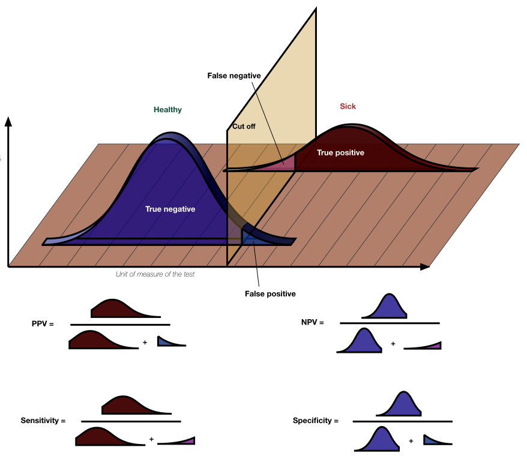

# Task 2

[Picture from wiki](
https://upload.wikimedia.org/wikipedia/commons/thumb/4/4f/ROC_curves.svg/1024px-ROC_curves.svg.png) gives insight about approach for analytical solution

Illustration of [binary taxonomy](https://upload.wikimedia.org/wikipedia/commons/thumb/1/17/PPV%2C_NPV%2C_Sensitivity_and_Specificity.svg/1024px-PPV%2C_NPV%2C_Sensitivity_and_Specificity.svg.png) for continuous distributions

